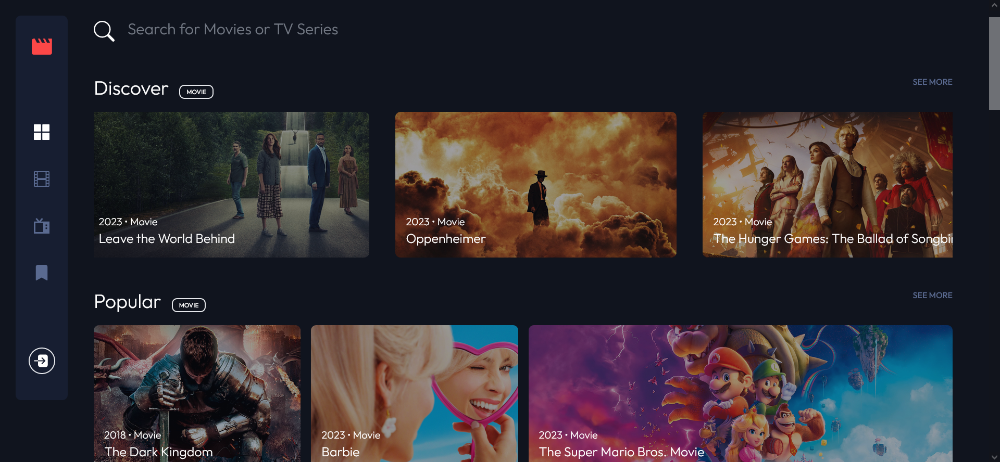
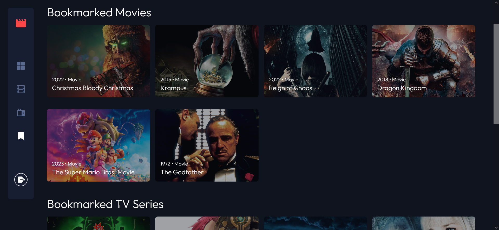

# Frontend Mentor - Entertainment Web App Solution

This is a solution to the [Entertainment web app challenge on Frontend Mentor](https://www.frontendmentor.io/challenges/entertainment-web-app-J-UhgAW1X).
Frontend Mentor challenges help you improve your coding skills by building realistic project.

## Table of contents

- [Overview](#overview)
  - [Screenshots](#screenshots)
  - [Links](#links)
- [My process](#my-process)
  - [Built with](#built-with)
  - [What I learned](#what-i-learned)
- [Author](#author)

## Overview

### Screenshots

### Links
- [Live Site URL](https://portfolio-entertainment-app.web.app/)

## My process

### Built with

- [Vue.js](https://vuejs.org/) / [Vue Router](https://router.vuejs.org/)
- [Vite](https://vitejs.dev/)
- [Firebase](https://firebase.google.com/)
- Flexbox
- CSS Grid
- [Tailwind CSS](https://tailwindcss.com/)
- [Vue Flicking](https://naver.github.io/egjs-flicking/)

### What I learned

Firebase hosting, RESTful APIs

## Author

- Github - [@JaySm](https://github.com/Jay-Sm)
